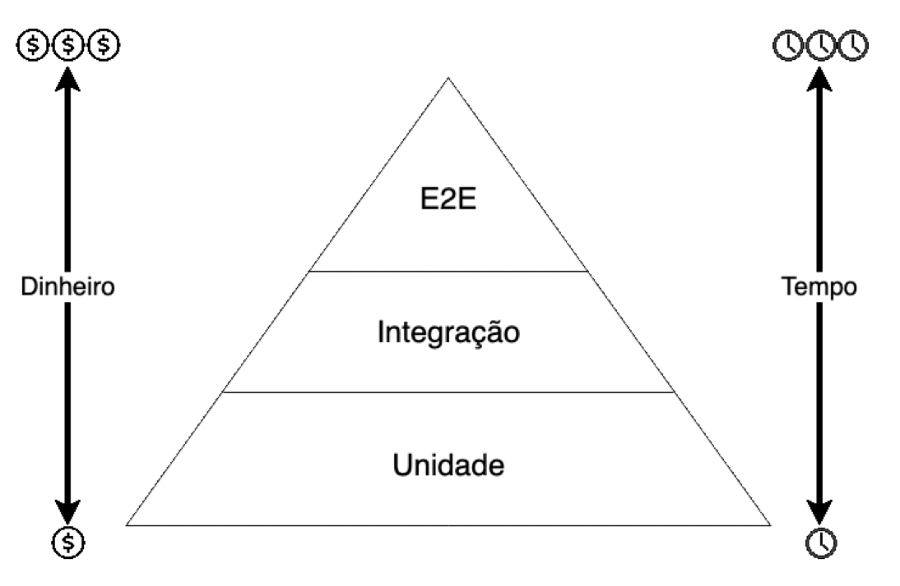
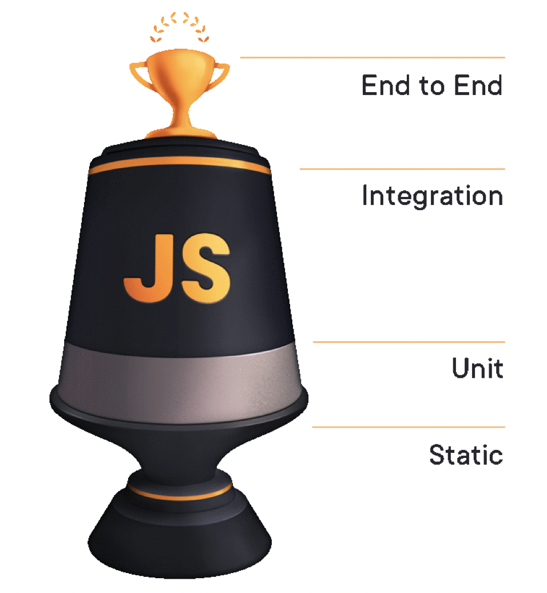
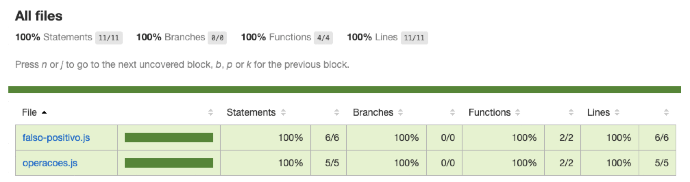
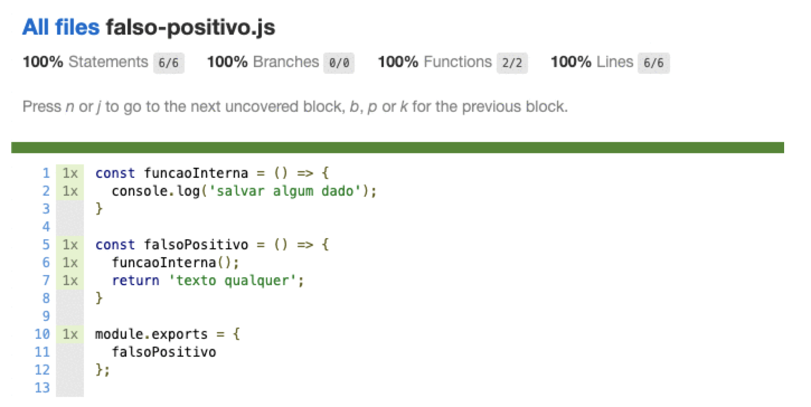

# JavaScript Assertivo

# Parte 1 - Fundamentos de testes

### Alguns dos (vários) motivos pelos quais você deveria fazer testes

- Confiança
    - Confiança ao escrever código e ao fazer mudanças
- Qualidade
    - Traz autonomia e independência para o time
- Tempo
    - Passamos a ganhar mais tempo quando escrevemos testes

> *Investir TEMPO, garantindo qualidade e construindo confiança no código que você escreve, com certeza trará bons frutos para o seu produto no longo prazo.*
> 

### A famosa pirâmide de testes



- Unidade
    - São pequenas partes isoladas do nosso código, como funções, utilitários ou componentes
- Integração
    - São testes mais completos e que envolvem o teste de várias unidades em conjunto, por isso recebem o nome de **Integração**
- E2E (end-to-end ou ponta-a-ponta)
    - São testes mais robustos e que visam simular o usuário interagindo com o navegador e de fato utilizando o sistema como se fosse real

**Tempo X Dinheiro 💰**

- Testes unitários são mais rápidos de serem feitos, já que quebramos nosso código em pedaços menores e garantimos que cada um deles funciona como deveria
    - Portanto, tanto o tempo e dinheiro gastos com o desenvolvimento quanto com uma estrutura de CI, é relativamente menor
- Testes de integração são um pouco mais demorados e envolvemos cenários mais completos a serem testados
    - O custo acaba sendo o mesmo de um teste unitários, porém o tempo investido nesse tipo de teste é um pouco maior, e pensando que as pessoas são pagas para desenvolver código, o preço acaba sendo elevado também
- Testes E2E envolvem um estrutura completa de aplicação (frontend e backend), já que agora os fluxos de usuário deverão ser simulados de forma completa.
    - Eles acabam sendo testes mais demorados e ainda mais caros, isso inclui um ambiente e uma estrutura de testes mais robustos, mais caros e que consequentemente demandam mais tempo para escrever todos os testes e configurar todas as pontas necessárias para que tudo funcione corretamente

**Estático** 

Conceito difundido por Kent C. Dodds em seu curso *[Testing JavaScript](https://testingjavascript.com/).* A ideia é considerar a etapa estática como um passo antes de qualquer um dos testes da pirâmide de testes. Trata-se da análise de código antes de qualquer codificação.



## 📎 Análise estática de código com ESLint

Vamos entender como funciona a análise estática de código e como ela é aplicada.

Podemos entender como uma etapa executada em tempo de desenvolvimento, podendo, inclusive, nos dar feedback enquanto escrevemos código. Essa etapa é fundamental para evitar que pequenos erros sejam cometidos.

> A ferramenta que veremos a seguir, em específico, é um tipo de linter. Linters são justamente ferramentas que nos ajudam a assegurar que determinado código segue determinada regra e estrutura de escrita (podendo, inclusive, nos ajudar a formatar um código). Dessa forma, podemos ter uma configuração em um projeto e fazer com que todos os arquivos sigam um mesmo padrão de escrita.
> 

No nosso caso, utilizaremos um linter chamado ESLint ([https://eslint.org/](https://eslint.org/)), que é um dos mais utilizados no ecossistema JavaScript.

### Getting started

**Instalação**

```
npm init -y
npm i --save-dev eslint
```

**Configuração**

```
npx eslint --init

- How would you like to use ESLint? **To check syntax, find problems, and enforce code style**
- What type of modules does your project use? **JavaScript modules (import/export)**
- Which framework does your project use? **None of these**
- Does your project use TypeScript? **No**
- Where does your code run? **<a> to toggle all**
- How would you like to define a style for your project? **Use a popular style guide**
- Which style guide do you want to follow? **Airbnb: https://github.com/airbnb/javascript**
- What format do you want your config file to be in? **JSON**

package.json
	scripts
		"lint": "npx eslint ./pasta-dos-seus-arquivos"

npm run lint
```

### Arquivo de configuração, regras e plugins

Vamos olhar o arquivo `.eslintrc.json` e entender o que significa cada coisa.

- env
    - Objeto que indica quais ambientes o ESLint validará
- extends
    - Array de opções utilizado para estender regras já predefinidas e plugins do ESLint
- parserOptions
    - Objeto que contém algumas opções da linguagem que o ESLint deve ou não suportar ao analisar o código
- rules
    - Objeto de configuração que indica quais regras devem ser habilitadas, tratadas como alertas ou como erro

Passo a passo de como criar regras customizadas de lint

([https://gabrieluizramos.com.br/escrevendo-suas-proprias-regras-de-lint](https://gabrieluizramos.com.br/escrevendo-suas-proprias-regras-de-lint)),

### Prettier

[https://prettier.io/](https://prettier.io/)

É um formatador de código que pode ser utilizado em conjunto com o ESLint para assegurar que algumas regras de estilo de código estão sendo aplicadas como deveriam.

O processo de instalação e configuração segue muito o feito anteriormente para o ESLint.

### Editorconfig

[https://editorconfig.org/](https://editorconfig.org/) 

É um arquivo de configuração para que os editores e IDEs possam facilitar a visualização e questões de espaçamentos.

### TypeScript

[https://www.typescriptlang.org/](https://www.typescriptlang.org/)

É uma possibilidade a mais quando falamos de análise estática. O TS trás vários benefícios como a tipagem estática.

## 📎 Simulando um framework de testes

Para entender mais como os frameworks de testes funcionam, vamos criar nossa pequena versão do Jest.

Blocos de verificação com `if/else` são as estruturas mais básicas que temos na linguagem e no final das contas servem para testarmos algum comportamento do código.

```js
// funções a serem testadas
const somaHorasExtras = (salario, valorHorasExtras) => {
	return salario + valorHorasExtras;
};
const calculaDesconto = (salario, descontos) => {
	return salario - descontos;
};

// variáveis com os valores
let esperado = 10;
let retorno = somaHorasExtras(5, 5);

// testa testa função somaHorasExtras
if (esperado === retorno) {
	console.log(`✅ Teste passou`);
} else {
	console.error(`🚨 Ih, deu ruim...`);
}
```

### Criando novas abstrações e iniciando nosso miniframework

```js
// função teste reutilizável
const teste = (titulo, esperado, retornado) => {
  if (esperado === retornado) {
    console.log(`✅  ${titulo} passou`);
  } else {
    console.log(`🚨 ${titulo} deu ruim...`);
  }
}

// duplicamos as funções apenas para vermos as diferenças
const somaHorasExtras = (salario, valorHorasExtras) => {
	return salario + valorHorasExtras;
};

const calculaDesconto = (salario, descontos) => {
	return salario - descontos;
};

teste('somaHorasExtras', 10, somaHorasExtras(5, 5));
teste('calculaDesconto', 5, calculaDesconto(10, 5));
```

### Conhecendo asserções ao criar novos utilitários

```js
const verifiqueQue = (valor) => {
  const assercoes = {
    ehExatamenteIgualA(esperado) {
      if (valor !== esperado) {
        throw {};
      }
    }
  };

  return assercoes;
}

const teste = (titulo, funcaoTeste) => {
	try {
		funcaoTeste();
		console.log(`✅ ${titulo} passou`);
	} catch (err) {
    console.log(`🚨 ${titulo} deu ruim...`);
	}
}

// trouxemos as funcoes
const somaHorasExtras = (salario, valorHorasExtras) => {
	return salario + valorHorasExtras;
};

const calculaDesconto = (salario, descontos) => {
	return salario - descontos;
};

teste('somaHorasExtras', () => {
  const esperado = 10;
  const retornado = somaHorasExtras(5, 5);

	verifiqueQue(retornado).ehExatamenteIgualA(esperado);
});
teste('calculaDesconto', () => {
	const esperado = 5;
	const retornado = calculaDesconto(10, 5);

	verifiqueQue(retornado).ehExatamenteIgualA(esperado);
});
```

### Trabalhando com *assert* nativo no NodeJS

O NodeJS também possui um módulo só para lidar com asserções chamado *[assert](https://nodejs.org/api/assert.html).* E existe também a função `console.assert` que pode ser utilizado tanto no Node quanto no navegador.

```js
const assert = require('assert');

assert.strictEqual(5, 5); // asserção válida
assert.strictEqual(5, 10); // asserção inválida
```

## 📎 Diga olá ao Jest!

O [Jest](https://jestjs.io/) é um framework de testes construído pelo Facebook e o que chama atenção é sua simplicidade e por se tratar de uma ferramenta completa que nos facilita tudo que precisamos em um ambiente de testes.

### Instalação e primeiros passos

```js
npm init -y
npm i --save-dev jest

//package.json
"scripts": {
   "test": "jest",
   "test:watch": "jest --watch"
},
```

O Jest verifica por padrão, qualquer arquivo de teste finalizado com extensão `.js`, `.jsx`, `.ts` ou `.tsx`, sejam eles localizados ou não em uma pasta `__**tests**__` ou com um sufixo `.spec` ou `.test`.

### Configurações iniciais e conhecendo do CLI

Assim o o ESLint, o Jest possui uma CLI própria que nos ajuda em várias tarefas.

[Documentação](https://jestjs.io/pt-BR/docs/cli) da CLI do Jest.

O Jest (e várias outras ferramentas de testes) se refere aos testes como *suítes.*

```js
Watch mode

npm test -- --watch
npx jest --watch
```

### Primeiro teste

```js
const { calculaDesconto, somaHorasExtras } = require('./operacoes');

describe('Operações', () => {
  it('deve somar horas extras', () => {
    const esperado = 10;
    const retornado = somaHorasExtras(5, 5);

    expect(retornado).toBe(esperado);
  });

  it('deve calcular descontos', () => {
    const esperado = 5;
    const retornado = calculaDesconto(10, 5);

    expect(retornado).toBe(esperado);
  });
});
```

Se fôssemos traduzir para português a estrutura que acabamos de criar, poderíamos ler algo mais ou menos assim: **isso deve somar horas extras e espera-se que o valor retornado somaHorasExtras(5, 5) seja igual ao esperado.**

Para nos ajudar com essa questão de leitura, temos uma função chamada `it`. Ela é apenas um apelido para a função `test`, que já aplicamos, então funciona da mesma maneira. Ela apenas muda a forma como nosso teste é lido.

Por isso, muitas pessoas acabam dizendo que um teste bem estruturado também serve como uma pequena estrutura de documentação, já que ajuda a indicar o funcionamento de um sistema.

Como esses dois testes estão relacionados a um mesmo contexto, podemos, opcionalmente, agrupá-los com uma função chamada `describe`. Essa função é apenas um utilitário para encapsularmos esses testes dentro de um determinado escopo.

### Executando tarefas repetitivas com Hooks

O Jest possui funções chamadas hooks que são utilizadas para executar um trecho de código em certas etapas do ciclo de vida do teste. Um ciclo de vida é um determinado momento antes e depois da execução de seu teste.

Esses hooks calham muito bem quando precisamos limpar algum dado que criamos ao iniciar um teste ou executar alguma configuração repetitiva.

Existem quatro hooks:

- `beforeAll` - para executar algo antes da execução de todos os testes
- `beforeEach` - para executar algo antes da execução individual de cada teste
- `afterAll` - para executar algo após a execução de todos os testes
- `afterEach` - para executar algo após a execução individual de cada teste

Exemplo de uso dos hooks:

```js
const { calculaDesconto, somaHorasExtras } = require('./operacoes');

describe('Operações', () => {
  beforeAll(() => {
    console.log('Hook antes de todos os testes');
  });
  afterAll(() => {
    console.log('Hook após todos os testes');
  });
  beforeEach(() => {
    console.log('Hook antes de cada um dos testes iniciar');
  });
  afterEach(() => {
    console.log('Hook após cada um dos testes finalizar');
  });

  it('deve somar horas extras', () => {
    const esperado = 10;
    const retornado = somaHorasExtras(5, 5);

    expect(retornado).toBe(esperado);
  });

  it('deve calcular descontos', () => {
    const esperado = 5;
    const retornado = calculaDesconto(10, 5);

    expect(retornado).toBe(esperado);
  });
});
```

### Como ler o relatório de testes

Para exibir esse relatório utilizando o Jest, podemos utilizar o argumento `--coverage` ao executar os testes.

```js
//package.json
"scripts": {
    "test": "jest",
    "test:watch": "jest --watch",
    "test:coverage": "jest --coverage",
},
```

Ao executar esse novo comando, teremos uma tabela contendo um relatório dos nossos testes com algumas colunas e linhas:

- `File` - os arquivos de teste que foram executados nos testes
- `Stmts (ou declarações)` - indica a porcentagem dos termos de declaração (como variáveis e imports) que foram ou não cobertos ao executar o código
- `Branch` - indica a porcentagem de ramificações (como blocos if/else ou switch/case) que foram executadas ao longo dos testes
- `Funcs` - indica a  porcentagem de funções que foram executadas ao longo dos testes
- `Lines` - indica a porcentagem de linhas que foram executadas ao longo dos testes
- `Uncovered Lines` - indica quais linhas de um determinado arquivo não foram executadas pelos testes

Um pasta `coverage` também é gerada e nela encontramos os relatórios criados.

Podemos dizer para o Jest que queremos pular algum teste específico ou que queremos executar um teste em particular utilizando as funções `skip` e `only`:

```
it.skip(...);
it.only(...);
```

### Cobertura e a corrida pelo 100%

Dizemos que um código tem sua cobertura ou está coberto por testes quando, justamente através de nossos testes, suas linhas foram executadas.

Entretanto, é comum olhar para um relatório de testes e acreditar que seu código está bem testado só porque ele indica que sua cobertura é, por exemplo, de 100%. Isso é um completo engano.

É muito fácil gerar **falsos positivos** em testes e isso quer dizer que devemos nos atentar ao analisar esses relatórios para testar nosso código de forma coerente.

```js
//falso positivo
const funcaoInterna = () => {
  console.log('salvar algum dado');
}

const falsoPositivo = () => {
  funcaoInterna();
  return 'texto qualquer';
}

module.exports = {
  falsoPositivo
};
```

```js
//falso positivo teste
const { falsoPositivo } = require('./falso-positivo');

it('retorna um texto qualquer', () => {
  expect(falsoPositivo()).toEqual(expect.any(String));
});
```

Se rodarmos nosso comando para gerar o relatório de cobertura agora, veremos que tudo está 100% coberto, ou seja, todo o código que criamos foi executado:





Entretanto, claramente não testamos nada sobre a funcaoInterna. Ela apenas é indicada como coberta porque nossa função falsoPositivo a executa internamente.

Ou seja, mesmo o código da funcaoInterna tendo sido executado, não possuímos nenhum teste para garantir que ela funciona como deveria e nem mesmo para garantir que a função falsoPositivo a está executando.

O que eu quero alertar com tudo isso é que é muito fácil se deixar enganar por relatórios que trazem cobertura de teste. O que as ferramentas de teste fazem é nada mais que executar o seu código e mapear as linhas que são executadas. Cabe a você, desenvolvedor ou desenvolvedora, garantir que seu teste se assemelha à forma como seu software é utilizado.

### Indo além nas configurações

Podemos criar um arquivo de configuração que será lido de forma automática pelo Jest sempre que rodarmos um teste. Por padrão o Jest já procura pelo arquivo `jest.config.js` na raiz do projeto.

```js
module.exports = {
  collectCoverage: true,
};
```

Esse arquivo é muito importante quando trabalhamos com diversos ambientes de testes, como por exemplo, testes para o front-end e para o back-end.

A documentação oficial mostrando detalhes sobre a configuração desse arquivo fica em [https://jestjs.io/pt-BR/docs/configuration](https://jestjs.io/pt-BR/docs/configuration). 

Se preferir, também podemos colocar diretamente essas configurações no **package.json** através de um objeto `jest`

```js
"jest": {
	"collectCoverage": true
}
```